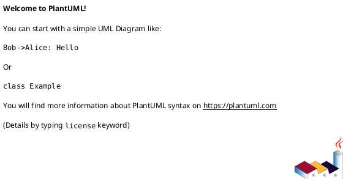
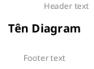
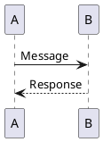
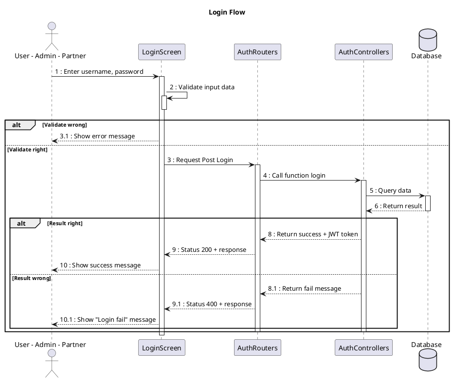
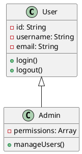
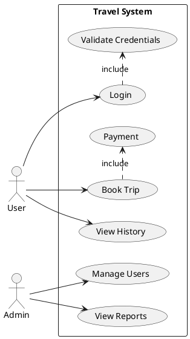
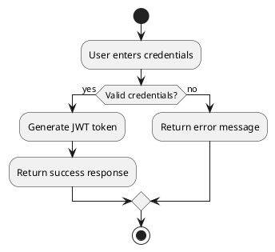
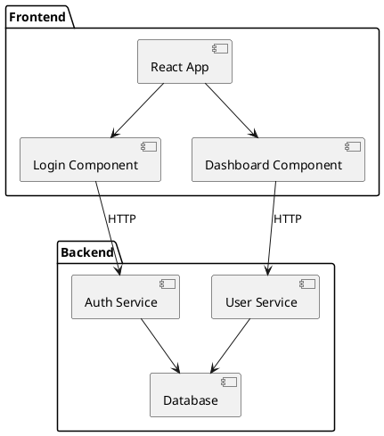
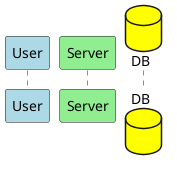

# PlantUML Guide - Hướng dẫn viết PlantUML

## 📋 Mục lục
- [Giới thiệu](#giới-thiệu)
- [Cài đặt](#cài-đặt)
- [Cú pháp cơ bản](#cú-pháp-cơ-bản)
- [Các loại diagram](#các-loại-diagram)
- [Sequence Diagram](#sequence-diagram)
- [Class Diagram](#class-diagram)
- [Use Case Diagram](#use-case-diagram)
- [Activity Diagram](#activity-diagram)
- [Component Diagram](#component-diagram)
- [Styling và Theme](#styling-và-theme)
- [Best Practices](#best-practices)
- [Ví dụ thực tế](#ví-dụ-thực-tế)
- [Troubleshooting](#troubleshooting)

## 🎯 Giới thiệu

PlantUML là một công cụ mạnh mẽ để tạo ra các diagram từ text description. Nó hỗ trợ nhiều loại diagram khác nhau và rất phù hợp cho việc documentation trong software development.

### Ưu điểm:
- ✅ **Version Control Friendly**: Text-based, dễ dàng track changes
- ✅ **Fast Creation**: Tạo diagram nhanh chóng
- ✅ **Consistency**: Đảm bảo style nhất quán
- ✅ **Integration**: Tích hợp tốt với IDE và documentation tools

## 🛠 Cài đặt

### VS Code Extension:
1. Cài đặt extension "PlantUML"
2. Cài đặt Java Runtime Environment (JRE)
3. Cài đặt Graphviz (optional nhưng recommended)

### Commands:
```bash
# Windows (với Chocolatey)
choco install plantuml
choco install graphviz

# Mac (với Homebrew)
brew install plantuml
brew install graphviz

# Ubuntu/Debian
sudo apt-get install plantuml graphviz
```

## 📝 Cú pháp cơ bản

### Cấu trúc file:


### Comments:
```plantuml
' Single line comment
/' 
Multi-line comment
'/
```

### Titles và Headers:


## 🔄 Sequence Diagram

### Cú pháp cơ bản:


### Ví dụ chi tiết (như file Login.pu):


### Các loại mũi tên:
```plantuml
A -> B   : Synchronous call
A ->> B  : Asynchronous call
A --> B  : Response
A -x B   : Lost message
A <-> B  : Bidirectional
```

### Lifecycle:
```plantuml
activate A
A -> B : Message
deactivate A
```

### Grouping:
```plantuml
alt condition
    A -> B : Message 1
else other condition
    A -> B : Message 2
end

opt optional
    A -> B : Optional message
end

loop 1,5
    A -> B : Repeat message
end
```

## 📊 Class Diagram

### Cú pháp cơ bản:


### Relationships:
```plantuml
ClassA <|-- ClassB      : Inheritance
ClassA <|.. ClassB      : Realization
ClassA --> ClassB       : Association
ClassA --* ClassB       : Composition
ClassA --o ClassB       : Aggregation
ClassA .. ClassB        : Dependency
```

### Visibility:
```plantuml
class Example {
  +public: String
  -private: String
  #protected: String
  ~package: String
}
```

## 🎯 Use Case Diagram



## 🔄 Activity Diagram



## 📦 Component Diagram



## 🎨 Styling và Theme

### Colors:


### Themes:
```plantuml
@startuml
!theme amiga
' hoặc: !theme aws-orange, !theme bluegray, !theme plain
@enduml
```

### Custom styling:
```plantuml
@startuml
skinparam backgroundColor #EEEBDC
skinparam handwritten true
skinparam monochrome true
@enduml
```

## 💡 Best Practices

### 1. **Clear Naming**:
```plantuml
' ✅ Good
participant "User Interface" as UI
participant "Authentication Service" as Auth

' ❌ Bad
participant A
participant B
```

### 2. **Consistent Numbering**:
```plantuml
User -> UI : 1: Enter credentials
UI -> Auth : 2: Validate
Auth -> DB : 3: Query user
```

### 3. **Proper Activation**:
```plantuml
' ✅ Good - activate khi cần
activate Service
Service -> DB : Query
deactivate Service

' ❌ Bad - quên deactivate
activate Service
Service -> DB : Query
```

### 4. **Meaningful Alt/Opt**:
```plantuml
alt Valid credentials
    Auth -> UI : Success response
else Invalid credentials
    Auth -> UI : Error response
end
```

### 5. **Clean Structure**:
```plantuml
@startuml
title "Clear Title"

' Define participants first
actor User
participant UI
participant Service
database DB

' Then define interactions
User -> UI : Action
UI -> Service : Process
Service -> DB : Query
DB --> Service : Result
Service --> UI : Response
UI --> User : Display
@enduml
```

## 🔧 Ví dụ thực tế

### Chat System Sequence:
```plantuml
@startuml
title Chat Message Flow

actor User1
actor User2
participant ChatUI
participant ChatRouter
participant ChatController
participant SocketIO
database MongoDB

User1 -> ChatUI : 1: Type message
ChatUI -> ChatRouter : 2: POST /chat/:id/message
activate ChatRouter

ChatRouter -> ChatController : 3: sendMessage()
activate ChatController

ChatController -> MongoDB : 4: Save message
activate MongoDB
MongoDB --> ChatController : 5: Message saved
deactivate MongoDB

ChatController -> SocketIO : 6: Emit message
activate SocketIO
SocketIO -> ChatUI : 7: Broadcast to room
SocketIO -> User2 : 8: Real-time message
deactivate SocketIO

ChatController --> ChatRouter : 9: Success response
deactivate ChatController
ChatRouter --> ChatUI : 10: 200 OK
deactivate ChatRouter
@enduml
```

### API Architecture:
```plantuml
@startuml
!include <C4/C4_Component>

title API Architecture

Container_Boundary(api, "Travelmate API") {
  Component(router, "Chat Router", "Express Router", "Handle chat routes")
  Component(controller, "Chat Controller", "Business Logic", "Process chat operations")
  Component(middleware, "Auth Middleware", "Security", "JWT validation")
  Component(socket, "Socket.IO", "Real-time", "WebSocket connection")
}

ContainerDb(mongo, "MongoDB", "Database", "Store chat data")
Container(client, "React App", "Frontend", "User interface")

Rel(client, router, "HTTP/WS")
Rel(router, middleware, "Validate")
Rel(router, controller, "Process")
Rel(controller, mongo, "Query")
Rel(socket, client, "Real-time")
@enduml
```

## 🚨 Troubleshooting

### Common Issues:

1. **Syntax Errors**:
```plantuml
' ❌ Wrong
A -> B Message

' ✅ Correct
A -> B : Message
```

2. **Missing @startuml/@enduml**:
```plantuml
' ❌ Wrong
participant A
A -> B : Message

' ✅ Correct
@startuml
participant A
A -> B : Message
@enduml
```

3. **Activation Issues**:
```plantuml
' ❌ Wrong - không cân bằng
activate A
A -> B : Message

' ✅ Correct
activate A
A -> B : Message
deactivate A
```

### VS Code Tips:
- **Preview**: `Ctrl+Shift+P` → "PlantUML: Preview Current Diagram"
- **Export**: `Ctrl+Shift+P` → "PlantUML: Export Current Diagram"
- **Auto-completion**: Type `@startuml` và nhấn Tab

### Performance Tips:
- Sử dụng `!include` cho các diagram lớn
- Chia nhỏ diagram phức tạp
- Sử dụng `skinparam` một cách hợp lý

## 📚 Resources

- [PlantUML Official Documentation](https://plantuml.com/)
- [PlantUML Language Reference](https://plantuml.com/guide)
- [Real World PlantUML Examples](https://real-world-plantuml.com/)
- [PlantUML Cheat Sheet](https://plantuml.com/cheat-sheet)

---

## 🎯 Tóm tắt

PlantUML là công cụ mạnh mẽ để tạo documentation. Key points:

1. **Start Simple**: Bắt đầu với các diagram đơn giản
2. **Be Consistent**: Giữ style và naming convention nhất quán
3. **Use Version Control**: Text-based nên dễ track changes
4. **Practice Regularly**: Càng dùng càng thành thạo
5. **Read Documentation**: Official docs rất chi tiết và hữu ích

Happy diagramming! 🚀