# PlantUML Guide - Hướng dẫn viết PlantUML

## 📋 Mục lục
- [Giới thiệu](#giới-thiệu)
- [Cài đặt](#cài-đặt)
- [Cú pháp cơ bản](#cú-pháp-cơ-bản)
- [Các loại diagram](#các-loại-diagram)
- [Sequence Diagram](#sequence-diagram)
- [Class Diagram](#class-diagram)
- [Use Case Diagram](#use-case-diagram)
- [Activity Diagram](#activity-diagram)
- [Component Diagram](#component-diagram)
- [Styling và Theme](#styling-và-theme)
- [Best Practices](#best-practices)
- [Ví dụ thực tế](#ví-dụ-thực-tế)
- [Troubleshooting](#troubleshooting)

## 🎯 Giới thiệu

PlantUML là một công cụ mạnh mẽ để tạo ra các diagram từ text description. Nó hỗ trợ nhiều loại diagram khác nhau và rất phù hợp cho việc documentation trong software development.

### Ưu điểm:
- ✅ **Version Control Friendly**: Text-based, dễ dàng track changes
- ✅ **Fast Creation**: Tạo diagram nhanh chóng
- ✅ **Consistency**: Đảm bảo style nhất quán
- ✅ **Integration**: Tích hợp tốt với IDE và documentation tools

## 🛠 Cài đặt

### VS Code Extension:
1. Cài đặt extension "PlantUML"
2. Cài đặt Java Runtime Environment (JRE)
3. Cài đặt Graphviz (optional nhưng recommended)

### Commands:
```bash
# Windows (với Chocolatey)
choco install plantuml
choco install graphviz

# Mac (với Homebrew)
brew install plantuml
brew install graphviz

# Ubuntu/Debian
sudo apt-get install plantuml graphviz
```

## 📝 Cú pháp cơ bản

### Cấu trúc file:


### Comments:
```plantuml
' Single line comment
/' 
Multi-line comment
'/
```

### Titles và Headers:

```plantuml
@startuml
title "Tên Diagram"
header "Header text"
footer "Footer text"
@enduml
```


## 🔄 Sequence Diagram

Sequence Diagram là loại biểu đồ phổ biến nhất trong PlantUML, dùng để mô tả luồng tương tác giữa các đối tượng theo thời gian. Đây là công cụ lý tưởng để mô tả API flows, business processes, và user interactions.

### 1. Cú pháp cơ bản:

```plantuml
@startuml
' 1. Khai báo participants
actor User
participant Frontend
participant Backend
database Database

' 2. Định nghĩa messages
User -> Frontend: Nhập thông tin
Frontend -> Backend: Gửi request API
Backend -> Database: Query dữ liệu
Database --> Backend: Trả về kết quả
Backend --> Frontend: Response API
Frontend --> User: Hiển thị kết quả

@enduml
```



### 2. Định nghĩa participants (thành phần tham gia):

```plantuml
@startuml
' Các loại participants
actor Actor           ' Người dùng/vai trò
participant Service   ' Mặc định
boundary UI           ' Giao diện 
control Controller    ' Điều khiển
entity Entity         ' Thực thể
database Database     ' Cơ sở dữ liệu
collections Queue     ' Hàng đợi
interface API         ' Giao diện lập trình

' Đặt alias và màu sắc
participant "Authentication Service" as Auth #lightblue
participant "Payment Service" as Payment #lightgreen
@enduml
```

### 3. Định nghĩa messages và mũi tên:

```plantuml
@startuml
participant A
participant B

' Các loại mũi tên
A -> B: Synchronous call (đồng bộ)
A ->> B: Asynchronous call (bất đồng bộ)
A -\ B: Lost message (tin nhắn bị mất)
A \\- B: Delay message
A --> B: Dotted arrow (phản hồi)
A -x B: Message nhưng ngừng tại mục tiêu 
A <-> B: Bidirectional arrow (hai chiều)

' Mũi tên với style
A -[#red]> B: Mũi tên màu đỏ
A -[#green,bold]> B: Mũi tên màu xanh lá và in đậm
A -[#blue,dashed]> B: Mũi tên màu xanh dương và gạch ngang
@enduml
```



### 4. Activation và Lifeline (Kích hoạt và vòng đời):


### 5. Grouping và Điều kiện:

```plantuml
@startuml
actor User
participant System

' Alt - Thay thế (if-else)
alt Đăng nhập thành công
    User -> System: Truy cập trang chủ
else Đăng nhập thất bại
    User -> System: Thử lại
end

' Opt - Điều kiện (if)
opt Người dùng đồng ý điều khoản
    User -> System: Tiếp tục đăng ký
end

' Loop - Vòng lặp
loop 3 times
    User -> System: Nhập OTP
end

' Par - Song song
par Nhiệm vụ song song
    User -> System: Task 1
else Nhiệm vụ khác
    User -> System: Task 2
end

' Critical region - Vùng nguy hiểm
critical Kết nối Database
    System -> Database: Query
end

' Break - Ngắt
break khi có lỗi
    System -> User: Thông báo lỗi
end

' Group - Nhóm
group Khởi tạo
    User -> System: Bắt đầu
end
@enduml
```



### 6. Ghi chú và Reference:

```plantuml
@startuml
participant A
participant B

' Ghi chú
note left of A: Ghi chú bên trái A
note right of A: Ghi chú bên phải A
note over A: Ghi chú phía trên A
note over A, B: Ghi chú trên nhiều đối tượng

' Ghi chú với màu sắc
note over A #yellow: Ghi chú màu vàng

' Reference - Tham chiếu đến sequence diagram khác
ref over A, B: Authenticate\nUser

' Trì hoãn message
... 5 minutes later ...
A -> B: After delay

' Khoảng cách
|||
A -> B: Message after some space
||50||
A -> B: Message after more space
@enduml
```



### 7. Ví dụ chi tiết (như file Login.pu):


### 8. Hiển thị thời gian:

```plantuml
@startuml
!pragma teoz true

actor User
participant System

User -> System: Login
System --> User: Success

' Hiển thị thời gian
@clock
User -> System: Perform action
System --> User: Result
@endclock

' Chỉ định thời gian
@0
User -> System: First action
@5
System --> User: Response after 5 ticks
@10
User -> System: Next action
@enduml
```

### 9. Tùy chỉnh style cho Sequence Diagram:


## 📊 Class Diagram

### Cú pháp cơ bản:


### Relationships:
```plantuml
ClassA <|-- ClassB      : Inheritance
ClassA <|.. ClassB      : Realization
ClassA --> ClassB       : Association
ClassA --* ClassB       : Composition
ClassA --o ClassB       : Aggregation
ClassA .. ClassB        : Dependency
```

### Visibility:
```plantuml
class Example {
  +public: String
  -private: String
  #protected: String
  ~package: String
}
```

## 🎯 Use Case Diagram


## 🔄 Activity Diagram


## 📦 Component Diagram


## 🎨 Styling và Theme

### Colors:


### Themes:
```plantuml
@startuml
!theme amiga
' hoặc: !theme aws-orange, !theme bluegray, !theme plain
@enduml
```

### Custom styling:
```plantuml
@startuml
skinparam backgroundColor #EEEBDC
skinparam handwritten true
skinparam monochrome true
@enduml
```

## 💡 Best Practices

### 1. **Clear Naming**:
```plantuml
' ✅ Good
participant "User Interface" as UI
participant "Authentication Service" as Auth

' ❌ Bad
participant A
participant B
```

### 2. **Consistent Numbering**:
```plantuml
User -> UI : 1: Enter credentials
UI -> Auth : 2: Validate
Auth -> DB : 3: Query user
```

### 3. **Proper Activation**:
```plantuml
' ✅ Good - activate khi cần
activate Service
Service -> DB : Query
deactivate Service

' ❌ Bad - quên deactivate
activate Service
Service -> DB : Query
```

### 4. **Meaningful Alt/Opt**:
```plantuml
alt Valid credentials
    Auth -> UI : Success response
else Invalid credentials
    Auth -> UI : Error response
end
```

### 5. **Clean Structure**:
```plantuml
@startuml
title "Clear Title"

' Define participants first
actor User
participant UI
participant Service
database DB

' Then define interactions
User -> UI : Action
UI -> Service : Process
Service -> DB : Query
DB --> Service : Result
Service --> UI : Response
UI --> User : Display
@enduml
```

### 6. **Sequence Diagram Tips Nâng Cao**:

#### a. Sắp xếp thứ tự participants hợp lý:
```plantuml
@startuml
' Sắp xếp participants từ trái sang phải theo luồng tương tác
actor Client
participant "Frontend" as FE
participant "API Gateway" as API
participant "Auth Service" as Auth
participant "Business Service" as BS
database "Database" as DB

' Luồng tương tác sẽ đi từ trái sang phải trực quan hơn
Client -> FE : Request
FE -> API : Forward
API -> Auth : Validate token
Auth --> API : Valid
API -> BS : Process
BS -> DB : Query
@enduml
```

#### b. Quản lý diagram phức tạp với divider:
```plantuml
@startuml
participant A
participant B

== Initialization Phase ==

A -> B : Step 1
B --> A : Ready

== Authentication Phase ==

A -> B : Login
B --> A : Token

== Transaction Phase ==

A -> B : Submit data
B --> A : Confirmation
@enduml
```

#### c. Sử dụng stereotype cho participant:
```plantuml
@startuml
participant "Client <<Web Browser>>" as C
participant "Backend <<Spring Boot>>" as B
participant "Database <<MongoDB>>" as D

C -> B : Request
B -> D : Query
@enduml
```

#### d. Sử dụng chú thích đa dòng:
```plantuml
@startuml
participant A
participant B

note over A
  Chú thích này giải thích quá trình
  xử lý phức tạp bên trong A
  - Validate input
  - Transform data
  - Prepare response
end note

A -> B : Result after processing
@enduml
```

#### e. Làm nổi bật phần quan trọng:
```plantuml
@startuml
participant A
participant B
participant C
participant D

' Highlight phần quan trọng
skinparam sequenceMessageAlign center
skinparam responseMessageBelowArrow true

A -> B : Request
B -> C : Process

' Làm nổi bật phần giao dịch quan trọng
C -[#red,bold]> D : <<Critical Transaction>>
D -[#red,bold]-> C : <<Verified>>

C --> B : Result
B --> A : Response
@enduml
```

#### f. Sử dụng autoactivate và autodeactivate:
```plantuml
@startuml
' Tự động kích hoạt/hủy kích hoạt
autoactivate on

participant A
participant B
participant C

A -> B : Request 1
B -> C : Request 2
return Response 2
return Response 1

A -> B : Another request
return Another response
@enduml
```

#### g. Kết hợp sequence diagram với các biểu đồ khác:
```plantuml
@startuml
' Sequence diagram chính
actor User
participant System

User -> System : Login

' Nhúng activity diagram để mô tả logic
box "Login Process" #LightBlue
participant System
end box

note over System
  <b>Login Process Detail:</b>
  start
  :Validate credentials;
  if (Valid?) then (yes)
    :Generate token;
  else (no)
    :Return error;
  endif
  end
end note

System --> User : Result
@enduml
```

## 🔧 Ví dụ thực tế

### Chat System Sequence:
```plantuml
@startuml
title Chat Message Flow

actor User1
actor User2
participant ChatUI
participant ChatRouter
participant ChatController
participant SocketIO
database MongoDB

User1 -> ChatUI : 1: Type message
ChatUI -> ChatRouter : 2: POST /chat/:id/message
activate ChatRouter

ChatRouter -> ChatController : 3: sendMessage()
activate ChatController

ChatController -> MongoDB : 4: Save message
activate MongoDB
MongoDB --> ChatController : 5: Message saved
deactivate MongoDB

ChatController -> SocketIO : 6: Emit message
activate SocketIO
SocketIO -> ChatUI : 7: Broadcast to room
SocketIO -> User2 : 8: Real-time message
deactivate SocketIO

ChatController --> ChatRouter : 9: Success response
deactivate ChatController
ChatRouter --> ChatUI : 10: 200 OK
deactivate ChatRouter
@enduml
```

### API Architecture:
```plantuml
@startuml
!include <C4/C4_Component>

title API Architecture

Container_Boundary(api, "Travelmate API") {
  Component(router, "Chat Router", "Express Router", "Handle chat routes")
  Component(controller, "Chat Controller", "Business Logic", "Process chat operations")
  Component(middleware, "Auth Middleware", "Security", "JWT validation")
  Component(socket, "Socket.IO", "Real-time", "WebSocket connection")
}

ContainerDb(mongo, "MongoDB", "Database", "Store chat data")
Container(client, "React App", "Frontend", "User interface")

Rel(client, router, "HTTP/WS")
Rel(router, middleware, "Validate")
Rel(router, controller, "Process")
Rel(controller, mongo, "Query")
Rel(socket, client, "Real-time")
@enduml
```

## 🚨 Troubleshooting

### Common Issues:

1. **Syntax Errors**:
```plantuml
' ❌ Wrong
A -> B Message

' ✅ Correct
A -> B : Message
```

2. **Missing @startuml/@enduml**:
```plantuml
' ❌ Wrong
participant A
A -> B : Message

' ✅ Correct
@startuml
participant A
A -> B : Message
@enduml
```

3. **Activation Issues**:
```plantuml
' ❌ Wrong - không cân bằng
activate A
A -> B : Message

' ✅ Correct
activate A
A -> B : Message
deactivate A
```

### VS Code Tips:
- **Preview**: `Ctrl+Shift+P` → "PlantUML: Preview Current Diagram"
- **Export**: `Ctrl+Shift+P` → "PlantUML: Export Current Diagram"
- **Auto-completion**: Type `@startuml` và nhấn Tab

### Performance Tips:
- Sử dụng `!include` cho các diagram lớn
- Chia nhỏ diagram phức tạp
- Sử dụng `skinparam` một cách hợp lý

## 📚 Resources

- [PlantUML Official Documentation](https://plantuml.com/)
- [PlantUML Language Reference](https://plantuml.com/guide)
- [Real World PlantUML Examples](https://real-world-plantuml.com/)
- [PlantUML Cheat Sheet](https://plantuml.com/cheat-sheet)

---

## 🎯 Tóm tắt

PlantUML là công cụ mạnh mẽ để tạo documentation. Key points:

1. **Start Simple**: Bắt đầu với các diagram đơn giản
2. **Be Consistent**: Giữ style và naming convention nhất quán
3. **Use Version Control**: Text-based nên dễ track changes
4. **Practice Regularly**: Càng dùng càng thành thạo
5. **Read Documentation**: Official docs rất chi tiết và hữu ích

Happy diagramming! 🚀

## 📊 Sequence Diagram cho Các Mẫu API Thông Dụng

### 1. API RESTful CRUD Operations:

```plantuml
@startuml
title RESTful CRUD API Flow
actor Client
participant "API Gateway" as Gateway
participant "User Service" as Service
database "User Database" as DB

== Create (POST) ==
Client -> Gateway: POST /users\nContent-Type: application/json\nBody: {name, email, ...}
activate Gateway
Gateway -> Service: createUser(payload)
activate Service
Service -> DB: INSERT INTO users
activate DB
DB --> Service: User Created (ID: 123)
deactivate DB
Service --> Gateway: Return 201 Created\n{id: 123, name, email, ...}
deactivate Service
Gateway --> Client: HTTP 201 Created\n{id: 123, name, email, ...}
deactivate Gateway

== Read (GET) ==
Client -> Gateway: GET /users/123
activate Gateway
Gateway -> Service: getUserById(123)
activate Service
Service -> DB: SELECT * FROM users WHERE id = 123
activate DB
DB --> Service: User Data
deactivate DB
Service --> Gateway: Return 200 OK\n{id: 123, name, email, ...}
deactivate Service
Gateway --> Client: HTTP 200 OK\n{id: 123, name, email, ...}
deactivate Gateway

== Update (PUT) ==
Client -> Gateway: PUT /users/123\nBody: {name: "New Name", ...}
activate Gateway
Gateway -> Service: updateUser(123, payload)
activate Service
Service -> DB: UPDATE users SET ... WHERE id = 123
activate DB
DB --> Service: Updated
deactivate DB
Service --> Gateway: Return 200 OK\n{id: 123, name: "New Name", ...}
deactivate Service
Gateway --> Client: HTTP 200 OK\n{id: 123, name: "New Name", ...}
deactivate Gateway

== Delete (DELETE) ==
Client -> Gateway: DELETE /users/123
activate Gateway
Gateway -> Service: deleteUser(123)
activate Service
Service -> DB: DELETE FROM users WHERE id = 123
activate DB
DB --> Service: Deleted
deactivate DB
Service --> Gateway: Return 204 No Content
deactivate Service
Gateway --> Client: HTTP 204 No Content
deactivate Gateway
@enduml
```

### 2. Authentication API Flow:

```plantuml
@startuml
title OAuth 2.0 Authorization Flow
actor "User" as user
participant "Client App" as client
participant "Authorization Server" as auth
participant "Resource Server" as api
database "User Database" as db

== 1. Authorization Request ==
user -> client: Access protected resource
activate client
client -> auth: GET /authorize?client_id=123&redirect_uri=...&response_type=code
activate auth
auth -> user: Display login page
user -> auth: Enter credentials
auth -> db: Validate credentials
activate db
db --> auth: Valid user
deactivate db
auth -> user: Request permissions/scope
user -> auth: Approve permissions
auth --> client: Redirect with authorization code
deactivate auth

== 2. Token Exchange ==
client -> auth: POST /token\nclient_id=123&client_secret=secret&code=...&grant_type=authorization_code
activate auth
auth -> db: Validate code & client
activate db
db --> auth: Valid
deactivate db
auth --> client: JSON response with access_token, refresh_token
deactivate auth

== 3. Resource Access ==
client -> api: GET /api/resource\nAuthorization: Bearer {access_token}
activate api
api -> auth: Validate token
activate auth
auth --> api: Token valid, scope=read
deactivate auth
api -> db: Fetch resource data
activate db
db --> api: Resource data
deactivate db
api --> client: Resource data response
deactivate api

== 4. Token Refresh (When Expired) ==
client -> auth: POST /token\ngrant_type=refresh_token&refresh_token=...&client_id=123&client_secret=secret
activate auth
auth --> client: New access_token
deactivate auth
deactivate client
@enduml
```

### 3. Microservices Communication:

```plantuml
@startuml
title Microservices Communication Flow
actor Client
participant "API Gateway" as Gateway
participant "User Service" as UserSvc
participant "Order Service" as OrderSvc
participant "Payment Service" as PaySvc
participant "Notification Service" as NotifSvc
queue "Message Queue" as Queue
database "User DB" as UserDB
database "Order DB" as OrderDB
database "Payment DB" as PayDB

== Create Order Flow ==
Client -> Gateway: POST /orders\n{products, quantity, ...}
activate Gateway

Gateway -> UserSvc: Validate user session
activate UserSvc
UserSvc -> UserDB: Get user data
UserDB --> UserSvc: User data
UserSvc --> Gateway: User validated
deactivate UserSvc

Gateway -> OrderSvc: Create order
activate OrderSvc
OrderSvc -> OrderDB: Save initial order
OrderDB --> OrderSvc: Order ID
OrderSvc -> Queue: Publish OrderCreated event
OrderSvc --> Gateway: Order created response
deactivate OrderSvc

Gateway -> PaySvc: Process payment
activate PaySvc
PaySvc -> PayDB: Record payment attempt
PayDB --> PaySvc: Recorded
PaySvc --> Gateway: Payment initiated
deactivate PaySvc

Gateway --> Client: 202 Accepted\n{orderId: "123", status: "processing"}
deactivate Gateway

== Async Processing ==
Queue -> PaySvc: OrderCreated event
activate PaySvc
PaySvc -> PayDB: Update payment status
PayDB --> PaySvc: Updated
deactivate PaySvc
PaySvc -> Queue: Publish PaymentCompleted event
activate Queue
Queue -> OrderSvc: PaymentCompleted event
activate OrderSvc
OrderSvc -> OrderDB: Update order status
OrderDB --> OrderSvc: Updated
OrderSvc -> Queue: Publish OrderFulfilled event
deactivate OrderSvc
Queue -> NotifSvc: OrderFulfilled event
activate NotifSvc
NotifSvc -> Client: Send email notification
NotifSvc -> Client: Send push notification
deactivate NotifSvc
@enduml
```

### 4. WebSocket Real-time Communication:

```plantuml
@startuml
title WebSocket Real-time Chat Flow
actor "User A" as UserA
actor "User B" as UserB
participant "Chat Frontend A" as FrontendA
participant "Chat Frontend B" as FrontendB
participant "WebSocket Server" as WSServer
database "Message Database" as DB

== Connection Establishment ==
UserA -> FrontendA: Open chat
activate FrontendA
FrontendA -> WSServer: WebSocket handshake\nGET /chat?token=abc
activate WSServer
WSServer --> FrontendA: 101 Switching Protocols
deactivate WSServer

UserB -> FrontendB: Open chat
activate FrontendB
FrontendB -> WSServer: WebSocket handshake\nGET /chat?token=xyz
activate WSServer
WSServer --> FrontendB: 101 Switching Protocols
deactivate WSServer

== Real-time Messaging ==
UserA -> FrontendA: Type message "Hello"
FrontendA -> WSServer: {type: "message", content: "Hello", room: "general"}
activate WSServer
WSServer -> DB: Save message
activate DB
DB --> WSServer: Message saved
deactivate DB
WSServer -> FrontendB: {type: "message", content: "Hello", from: "User A", room: "general"}
deactivate WSServer
FrontendB -> UserB: Display "User A: Hello"

UserB -> FrontendB: Type message "Hi there"
FrontendB -> WSServer: {type: "message", content: "Hi there", room: "general"}
activate WSServer
WSServer -> DB: Save message
activate DB
DB --> WSServer: Message saved
deactivate DB
WSServer -> FrontendA: {type: "message", content: "Hi there", from: "User B", room: "general"}
deactivate WSServer
FrontendA -> UserA: Display "User B: Hi there"

== Presence Updates ==
UserB -> FrontendB: Close chat
FrontendB -> WSServer: {type: "disconnect"}
activate WSServer
WSServer -> DB: Update user status
WSServer -> FrontendA: {type: "presence", user: "User B", status: "offline"}
deactivate WSServer
FrontendA -> UserA: Show User B is offline
deactivate FrontendB

UserA -> FrontendA: Close chat
FrontendA -> WSServer: {type: "disconnect"}
deactivate FrontendA
@enduml
```

### 5. File Upload API Flow:

```plantuml
@startuml
title File Upload API Flow
actor User
participant "Frontend" as Frontend
participant "API Server" as API
participant "File Service" as FileService
participant "CDN/Storage" as Storage
database "Database" as DB

== Direct Upload ==
User -> Frontend: Select file(s)
Frontend -> API: POST /upload\nContent-Type: multipart/form-data
activate API
API -> FileService: Handle file upload
activate FileService
FileService -> FileService: Validate file (type, size)
FileService -> FileService: Process file (resize, optimize)
FileService -> Storage: Store file
activate Storage
Storage --> FileService: File URL/path
deactivate Storage
FileService -> DB: Save file metadata
activate DB
DB --> FileService: Saved
deactivate DB
FileService --> API: Upload complete
deactivate FileService
API --> Frontend: 200 OK\n{fileId: "123", url: "https://cdn.../file.jpg"}
deactivate API
Frontend --> User: Show upload success

== Presigned URL Flow ==
User -> Frontend: Select large file
Frontend -> API: GET /upload/presigned?filename=large.zip&type=application/zip
activate API
API -> FileService: Generate presigned URL
activate FileService
FileService -> Storage: Request presigned URL
activate Storage
Storage --> FileService: Presigned URL + upload ID
deactivate Storage
FileService --> API: Return presigned details
deactivate FileService
API --> Frontend: 200 OK\n{presignedUrl: "https://...", uploadId: "abc"}
deactivate API

Frontend -> Storage: PUT https://... (Direct to storage)
activate Storage
Storage --> Frontend: 200 OK
deactivate Storage

Frontend -> API: POST /upload/complete\n{uploadId: "abc"}
activate API
API -> FileService: Complete multipart upload
activate FileService
FileService -> Storage: Finalize upload
activate Storage
Storage --> FileService: Final file URL
deactivate Storage
FileService -> DB: Save file metadata
activate DB
DB --> FileService: Saved
deactivate DB
FileService --> API: Upload complete
deactivate FileService
API --> Frontend: 200 OK\n{fileId: "456", url: "https://cdn.../large.zip"}
deactivate API
Frontend --> User: Show upload success
@enduml
```